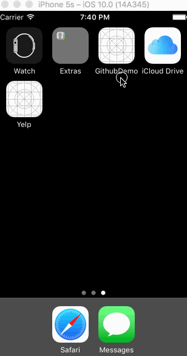

# Lab 2 - GitHub Repo Finder

GitHubDemo is an app that allows users to search the github repo.
Uses the [The GitHub API](https://developer.github.com/v3/search/).

Time spent: 15 hours spent in total

## User Stories

The following **required** functionality is completed:

- [x] Milestone 1: Setup
- [x] Milestone 2: Augment the GithubRepo Model to include Repo Description
- [x] Milestone 3: Create the Main Repo Feed
- [x] Milestone 3.1:  Use doSearch method to store newRepos
- [x] Milestone 3.2:  Add a table view to display search results
- [x] Milestone 3.3:  Design a custom cell to contain repository information
- [x] Milestone 4: Allow Filtering by Number of Stars
- [x] Milestone 4.1: Add a settings button to the left of the search bar
- [x] Milestone 4.2: Tapping on the settings button should modally present a settings view controller
- [x] Milestone 4.3: Add minimum number of stars filter
- [x] Milestone 4.4: Add save button for settings
- [x] Milestone 4.5: Add a cancel button that redirects to main view and discards change
- [x] Milestone 5: Allow filtering by language
- [x] Milestone 5.1: Implement table view to display settings
- [x] Milestone 5.2: Implement filter by language switch
- [x] Milestone 5.3: Shows list of languages when toggling switch
- [x] Milestone 5.4: Tapping on a language toggles whether it will be included in the search

The following **optional** features are implemented:

No optionals completed

## Video Walkthrough

Here's a walkthrough of implemented user stories:
[GitHubGif](http://imgur.com/a/oX7cN)

GIF created with [LiceCap](http://www.cockos.com/licecap/).

## Notes

Describe any challenges encountered while building the app.
Getting the language settings to work was fairly challenging. I had to tell the switch controls to toggle itself when the Filter by language option is checked or unchecked.  To pass the data between switch to view, I had to learn and implement a delegate method.

## License

    Copyright [yyyy] [name of copyright owner]

    Licensed under the Apache License, Version 2.0 (the "License");
    you may not use this file except in compliance with the License.
    You may obtain a copy of the License at

        http://www.apache.org/licenses/LICENSE-2.0

    Unless required by applicable law or agreed to in writing, software
    distributed under the License is distributed on an "AS IS" BASIS,
    WITHOUT WARRANTIES OR CONDITIONS OF ANY KIND, either express or implied.
    See the License for the specific language governing permissions and
    limitations under the License.